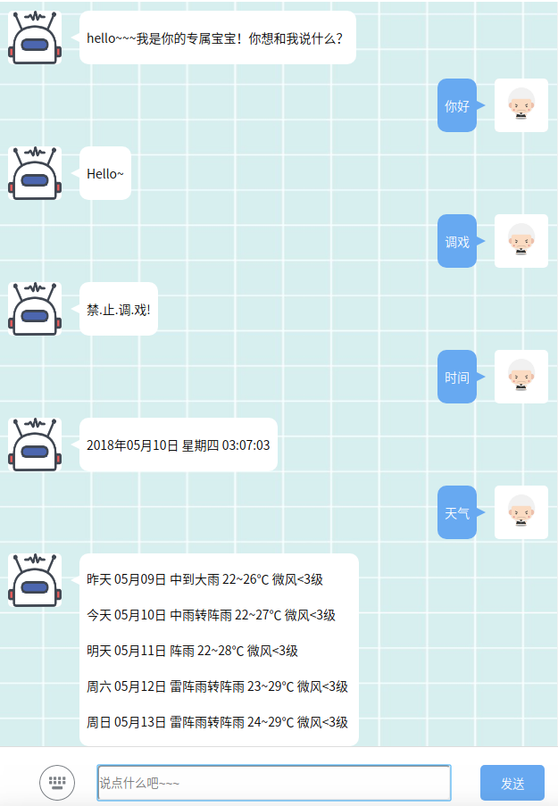
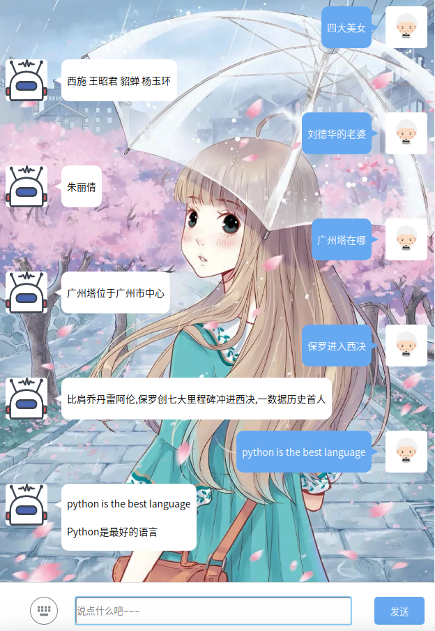

# 基于 AIML 和 WebQA 的智能对话模型

## 概述
1. AIML 人工智能标记语言
2. WebQA 开放域问答
3. Deeplearning 深度学习
4. 效果展示





## 启动服务
### 环境说明
Linux/Python2.7/PyCharm

### 安装依赖
```
$ pip2 install jieba
$ pip2 install aiml
$ pip2 install lxml
$ pip2 install beautifulsoup4
$ pip2 install flask
```

### 运行流程
Working directory: chatbot-aiml-webqa/core
```
$ cd chatbot-aiml-webqa/core
$ python2 web/server.py (nohub)

> ......
> * Running on http://0.0.0.0:5000/ (Press CTRL+C to quit)

CURL:
$ curl "0.0.0.0:5000/chat" -d "message=新闻"
$ curl "0.0.0.0:5000/chat" -d "message=天气"
$ curl "0.0.0.0:5000/chat" -d "message=时间"
```

## 处理流程
### 步骤一：预处理
1. 限制字数
2. 过滤敏感词（恶心、政治、色情、违法......）

### 步骤二：知识库匹配（AIML）
1. 基本功能：打招呼、闲聊......
2. 异常处理：问题太长、空白问题、找不到回复......
3. 情绪回答：表情、夸奖、嘲笑......

如果匹配不到回答，进行步骤三

### 步骤三：互联网搜索（WebQA）
1. 新闻----新浪新闻
2. 文章----每日一文
3. 笑话----糗事百科
4. 时间----搜狗时间
5. 天气----搜狗天气
6. 空气----搜狗空气
7. 其他遍历百度搜索
> * 百度汉语
> * 百度翻译
> * 百度图谱
> * 百度汇率
> * 百度计算
> * 百度股票
> * 百度歌词
> * 百度推荐
> * 百度最新
> * 百度百科
> * 百度知道

如果搜索不到回答，进行步骤四

### 步骤四：神经网络
基于Seq2Seq模型的下一代对话引擎不仅仅是在现有的回答中训练最佳回答，而是能自我创造一个类似于人类的回答。  
语料库：http://61.93.89.94/Noah_NRM_Data/  
目前这部分没时间实现......暂时先用图灵机器人API代替吧~~~

### 学习功能
利用AIML模板+shelve存储  
1. \* 说错 *
2. \* 答错 *
3. ......
```
ME > 世界上最漂亮的人是谁
AI > 灰姑娘
ME > 你说错了
AI > 那你教我吧
ME > 白雪公主
AI > 我学会啦，下次你就可以问我"世界上最漂亮的人是谁"......
ME > 世界上最漂亮的人是谁
AI > 白雪公主
```

## 参考链接
1. https://github.com/SnakeHacker/QA-Snake
2. https://github.com/ictar/XIXI
3. https://github.com/fwwdn/sensitive-stop-words